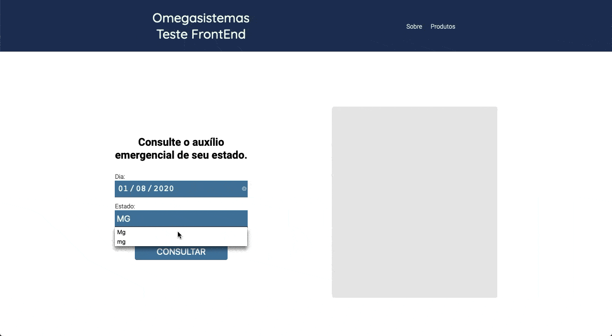

## Omegasistemas Teste FrontEnd
 
- Como rodar:
   - Abra o arquivo __index.html__
   - Acesse a pagina do Github-Pages clicando [AQUI](https://andre2l2.github.io/omegasistemas-teste-front-end/).
   - __Se por acaso, no github pages não estiver funcinado coretamente tente abrir diretamente na sua máquina pelo arquivo *index.html*__.
 

 
- O que melhorar?
   - Fazer uma verificação do estado para ver se o usuário não digitou errado.
   - Melhorias e refectory para um melhor desempenho na máquina do usuário
   - Fazer no um futuro form para saber o total de usuários que acessam a plataforma.
 
- Quais estados estão funcionando:
   - MG
   - GO
   - PA
   - CE
   - BA
   - PR
   - SC
   - TO
   - PE
 
- Quais frameworks eu usei?
   - SASS: Sass é um compilador css que auxilia no desenvolvimento, te dando o famoso "super-power" podendo assim usar if's, for, @mixin's. SASS te permite fazer uma ótima organização assim facilitando a manutenção como o exemplo abaixo.
   - fetch é uma das formas de se consumir API com javascript..
 
   ```SCSS
   body {
       margin: 0;
       padding: 0;
       box-sizing: border-box;
         
       main {
           width: 70%;
           height: 4rem;
 
           div {
               ...
           }
       }
   }
   ```
 
 

